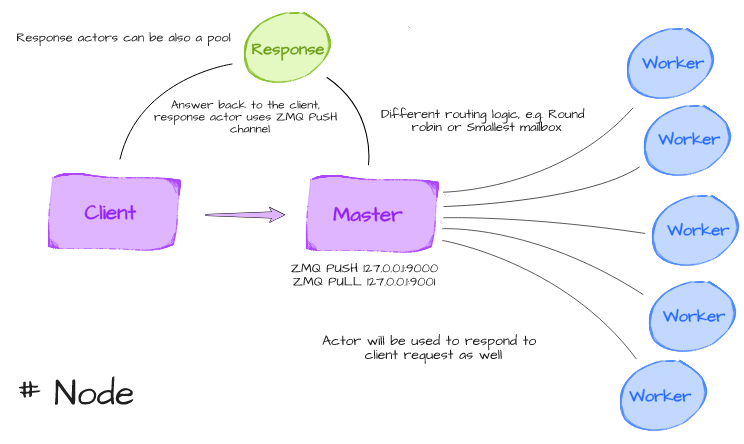

# Tasq

Distributed task queue leveraging ZMQ sockets, cloudpickle serialization,
and an actor-based worker system. Brokerless by design — no external services
required.

## Features

- ZMQ brokerless transport
- Delayed tasks and scheduled interval tasks
- Configuration on disk (JSON)
- Actor-based workers (I/O bound tasks)
- Process queue workers (CPU bound tasks)
- HMAC payload signing for integrity verification

## Quickstart

### Install

```sh
pip install .
```

### Start a worker

```sh
tq runner --log-level DEBUG
```

### Submit tasks

```python
import tasq

tq = tasq.queue("zmq://localhost:9000")


def fib(n):
    if n == 0:
        return 0
    a, b = 0, 1
    for _ in range(n - 1):
        a, b = b, a + b
    return b


# Asynchronous execution
fut = tq.put(fib, 50, name="fib-async")
fut.unwrap()  # 12586269025

# Blocking execution
res = tq.put_blocking(fib, 50, name="fib-sync")
res.unwrap()  # 12586269025

# Delayed execution (5 second delay)
fut = tq.put(fib, 5, name="fib-delayed", delay=5)

# Interval execution (every 8 seconds)
tq.put(fib, 5, name="fib-interval", eta="8s")
```

### Worker types

Start a process-based worker for CPU-bound tasks:

```sh
tq runner --worker-type process
```

Start an actor-based worker for I/O-bound tasks (default):

```sh
tq runner --worker-type actor
```

### Backend URL

```
zmq://localhost:9000?pull_port=9001
```

### Configuration

Set the `TASQ_CONF` environment variable to a JSON configuration file, or
pass `-c path/to/config.json` to the worker CLI.

```json
{
    "addr": "127.0.0.1",
    "zmq": {"push_port": 9001, "pull_port": 9000},
    "signkey": null,
    "unix": false,
    "log_level": "INFO",
    "num_workers": 4
}
```

### Security

Tasq supports HMAC signing of serialized payloads to prevent tampering. Pass
`signkey` when creating a queue or starting a worker:

```python
tq = tasq.queue("zmq://localhost:9000", signkey="my-secret-key")
```

## Architecture

See [ABOUT_THIS.md](ABOUT_THIS.md) for an in-depth explanation of the
internals and ZMQ usage.


